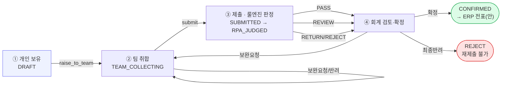
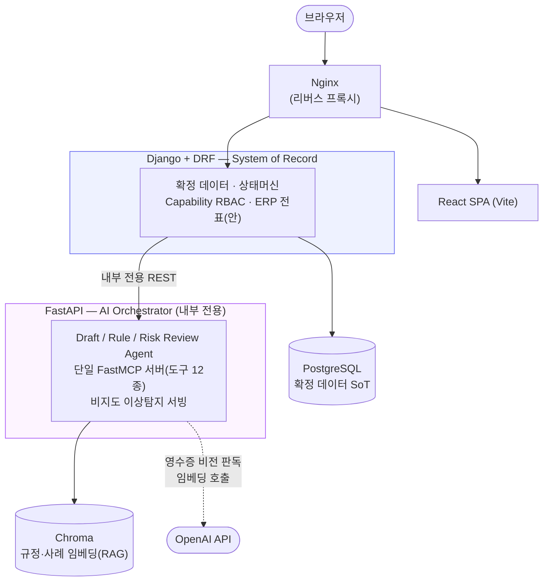

<div align="center">


# 법인카드 정산 자동화 플랫폼

**법인카드 정산 자동화 — 3개 AI Agent + 결정론적 룰 엔진 + 사람 최종 확정**

가상기업 "타이거 주식회사" 페르소나로 구성된 SKN29 Family AI Camp 최종 프로젝트


</div>

---

## 1. 이 프로젝트가 푸는 문제

법인카드 정산은 대부분의 회사에서 여전히 사람이 영수증을 한 장씩 읽고, 규정집을 뒤져
한도를 대조하고, 애매하면 옆자리에 물어보는 방식으로 돌아간다. 건수가 늘면 검토는 병목이 되고,
검토자가 바뀌면 같은 지출도 다른 결론이 나며, 부정 사용은 "우연히 눈에 띄어야" 걸린다.

이 프로젝트는 정산 업무(**입력 → 검토 → 확정**)를 세 축으로 나눠 자동화한다.

| 축 | 역할 | 왜 사람이 아니라 이걸 쓰는가 |
|---|---|---|
| **Draft Agent** | 영수증 비전 판독 → 지출 초안 자동 생성 | 반복적인 필드 채우기를 없앤다 |
| **Rule Agent** | 회사 규정 문서를 읽어 룰 그래프(판정 기준)를 자동 생성 | 규정이 바뀌면 룰도 다시 만든다 — 코드를 고치지 않고 문서만 바꾸면 된다 |
| **Risk Review Agent** | 비지도 이상탐지(1차) → RAG 내규 검증(2차) | 확실한 위반이 아닌 애매한 건만 골라 사람에게 근거와 함께 넘긴다 |

그리고 **확신이 가는 건도 회계 담당자의 최종 확정 없이는 `CONFIRMED`가 되지 않는다** — AI는
제안까지, 확정은 항상 사람의 결정이다. 룰은 제품이 미리 채워 파는 게 아니라, 고객이 자사 규정
문서를 올리면 Rule Agent가 그 문서에서 직접 만들어낸다 — 그래서 도입 첫날엔 최소한의 안전장치
(`DEFAULT GATE`) 하나만 있고, 규정을 계속 학습시킬수록 자동 확정 비율이 올라간다(검증셋 실측
26% → 100%, 오탐 0%).

---

## 2. 팀 소개


팀명 **BUBSAN**은 "법인카드 정산"에서 따왔다. 프로젝트를 시작할 때 담당 멘토님이 남긴
"호랑이를 그려야 고양이라도 그려진다"는 말씀에서 팀명 **호냥이**와 가상기업 **타이거 주식회사**가 탄생했다.

| 이름 | GitHub | 주요 기여 영역 |
|---|---|---|
| 정영석 | [@YoungSton3](https://github.com/YoungSton3) | PM — 프로젝트 총괄, AI·데이터 수집/전처리 |
| 김정민 | [@min1i](https://github.com/min1i) | Frontend — 프론트엔드 개발, QA·문서화 |
| 김진욱 | [@keroro729](https://github.com/keroro729) | Backend — 백엔드 개발, DB·인프라 |
| 이지현 | [@LeeJiHyeon](https://github.com/LeeJiHyeon) | ML — ML 모델, 데이터·품질 |
| 한경찬 | [@skn29hkc28](https://github.com/skn29hkc28) | AI Agent — AI Agent 개발, 데이터 수집/전처리 |

---

## 3. 핵심 흐름

정산 한 건은 4단계 상태머신을 탄다. 팀 수준 처리(팀장)와 회계 수준 처리(회계 담당자)는
분리돼 있고, 전이는 전부 `settlements/services.py` 한 곳에서만 일어나며 감사 로그로 남는다.



룰 엔진은 **분류기**다 — 확실한 건만 `PASS`(승인 대기) / `RETURN`·`REJECT`(보완·반려)로 갈라내고
나머지는 `REVIEW`로 사람에게 넘긴다. Risk Review는 그 `REVIEW` 건 중에서도 이상탐지 등급이 갈리는
건만 RAG 내규 검증까지 태운다(낮은 등급은 LLM 호출 0회로 고정 안내).

---

## 4. 시스템 아키텍처



원칙: **SoR은 Postgres 하나**(AI는 "제안"만 만들고 확정은 Django 서비스 레이어) · **관계형은
Django 경유 / 벡터는 Chroma 직접**(LLM·Tool의 Postgres 직접 SQL 금지) · **FastAPI는 내부
전용**(사용자 트래픽은 Django만 받는다) · 동기 REST(MVP), 무거운 작업은 관리자 온디맨드 배치.

---

## 5. 기술 스택

| 영역 | 스택 |
|---|---|
| **Frontend** | React 18 · TypeScript 5.6 · Vite 5 · React Router 6 · Axios |
| **Backend (SoR)** | Django 5.1 · DRF 3.15 · SimpleJWT · PostgreSQL(psycopg3) |
| **AI Orchestrator** | FastAPI 0.115 · FastMCP 2.4(MCP 1.9) · scikit-learn(비지도 이상탐지) |
| **RAG** | Docling(PDF 파싱) · Chroma(벡터 스토어) · OpenAI `text-embedding-3-large` |
| **LLM** | OpenAI GPT-4o(비전 판독 · Rule/Risk Agent) |
| **Infra** | Docker Compose · Nginx(리버스 프록시) |

---

## 6. 화면 소개

> 실행 화면 캡처는 준비 중이다 — 업데이트 예정.

주요 화면: 내 지출 등록(S-01) · 팀 취합·제출(S-02) · 검토 워크스페이스(S-03) · 룰 콘솔(S-04) ·
규정 문서 관리(S-05) · 예산 관리(S-08) · 카드 관리(S-09) · AI-LAB(관리자 실험 8탭).
화면별 상세는 [`llm_wiki/화면설계서/`](llm_wiki/) 참고.

---

## 7. 빠른 시작

```bash
cp .env.example .env          # OPENAI_API_KEY 등 각 값의 의미는 .env.example 주석 참고 — 없어도 부팅은 된다
docker compose up --build     # 최초 빌드는 수 분
```

`core`는 기동 시 `migrate`를 자동 수행한다. 그 다음 **무엇을 보여줄 것인지 골라 시드를 넣는다.**

```bash
# ① 초기 상태 — 회사 조직과 기본 게이트만. 규정 업로드 → 룰 생성 흐름을 처음부터 시연
docker compose exec core python manage.py seed_clean

# ② 적용 완료 — 룰이 완성되고 3개월 정산 이력이 쌓인 회사. 정산 흐름과 판정을 시연
docker compose exec core python manage.py seed_adopted
```

→ http://localhost:5173 에서 `kim` / `pass1234` 로그인.
프론트를 **실제 백엔드에 붙이려면** `.env`의 `VITE_USE_MOCK=false`(기본값은 `true` = 목업).

시드 데이터의 의미, RAG 규정 적재, 계정별 권한, 접속 주소 전체 목록은
**[`docs/SETUP.md`](docs/SETUP.md)** 에 있다.

---

## 8. 구현 상태

| 영역 | 상태 | 메모 |
|---|---|---|
| Django 도메인 모델 · 상태머신 · Capability RBAC | 완료 | 8도메인 18테이블, 4단계 상태머신 |
| 룰 엔진 (EvalContext 조립 → 그래프 선택 → 결정론적 순회) | 완료 | 제출이 판정을 자동으로 이어 돌린다 |
| 룰 콘솔 (S-04) 3개 탭 | 완료 · 실 API | 초안 편집·시뮬레이션·ACTIVE 승인·버전 롤백·대화형 수정 |
| Rule Agent (규정 → 룰 그래프 DRAFT) | 완료 | RAG → LLM 툴콜링 → 결정론적 조립 → 저장 |
| Draft Agent (초안 작성) | 완료 v2 | 저장 먼저 → 비전 판독 → 초안. 판정은 LLM이 예측하지 않고 엔진 dry-run 결과를 서술한다 |
| Risk Review Agent (① 이상탐지 → ② RAG 내규 검증) | 완료 · 실동작 | ①은 학습된 모델 파일이 있어야 실값 — `docs/SETUP.md` §4.1 |
| 규정 문서 업로드 → 인덱싱 → 룰 트리거 | 완료 | `docs/SETUP.md` §3-① |
| RAG 파싱·청킹·임베딩 전략 | 완료 · 평가 완료 | 채점 노트북은 `docling_eval/` |
| 에이전트 컨텍스트 툴 (도메인 카탈로그 주입) | 완료 P0 | DSL·EvalContext 경로·별표 축·판정 선택지·플래그를 live 모델에서 조립해 프롬프트에 주입 |
| 결정 사례 적재 (`case_history`) | 완료 | 사람이 AI와 다르게 판단한 건만. `seed_adopted` 30건 + 결정 시 자동 적재 |
| 알림 11종 · 규정문서 덤프/복원 | 완료 | 상태 전이·비동기 완료·룰 콘솔 사건 / `dump_policy_docs`·`load_policy_docs` |
| 검토 워크스페이스(S-03) · 규정 문서 관리(S-05) · 팀 취합(S-02) | 완료 · 실 API | |
| 내 지출(S-01) · 내역 불러오기 | 완료 · 실 API | ERP 결제기록 수집 → DRAFT 생성 |
| 예산 관리(S-08) · 카드 관리(S-09) · ERP 전표(안) 확인 | 완료 · 실 API | |
| 증빙 첨부 업로드 → 비전 판독 → EvalContext | 완료 · 실동작 | 업로드가 곧 판독 트리거 |

전체 미완/미연동 항목, 알려진 함정, 디렉터리 구조는 **[`docs/SETUP.md`](docs/SETUP.md)** 에 정리돼 있다.

---

## 9. 더 알아보기

- **[`CLAUDE.md`](CLAUDE.md)** — 팀 공용 개발 컨텍스트, 핵심 설계 결정과 그 이유, 최신 상태 보드
- **[`llm_wiki/_index.md`](llm_wiki/_index.md)** — 요구사항·기술명세서·RULE 명세서·화면설계서로 가는 색인
- **[`docs/SETUP.md`](docs/SETUP.md)** — 시드 데이터 전략, RAG 적재, 자주 쓰는 명령, 알려진 함정, 디렉터리 구조